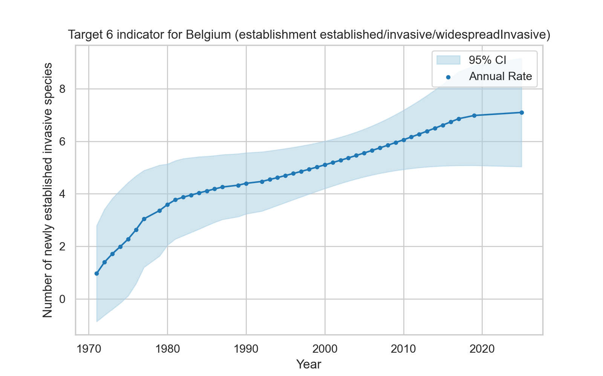
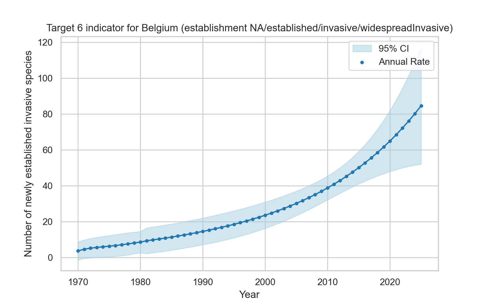
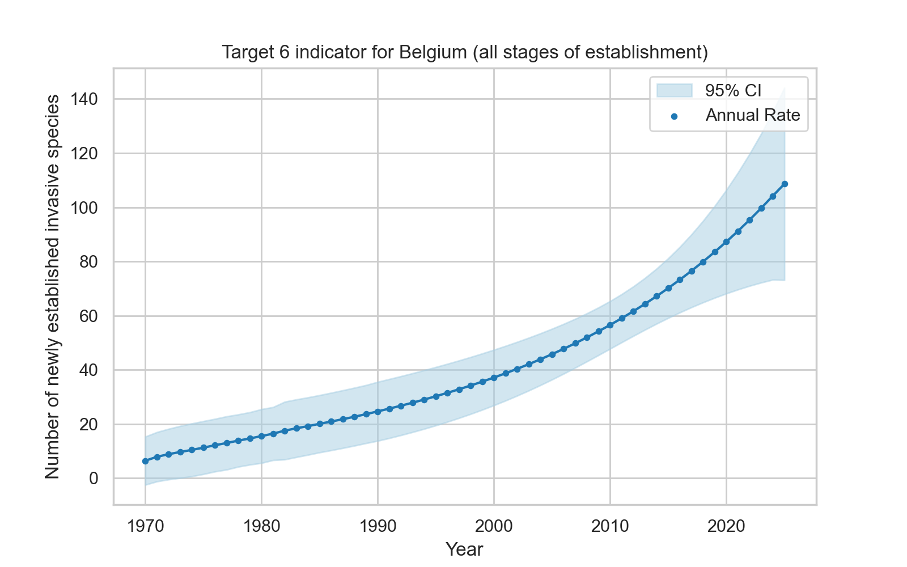

#### Indicator type 
indicator to evaluate policy

#### Explanation 
The [CBD Target 6](https://www.cbd.int/gbf/targets/6) headline indicator, calculated by applying b3alien, represents the rate of invasive alien species establishment. 

#### Applicability for policy  
[Target 6 of CBD](https://www.cbd.int/gbf/targets/6) is to 'eliminate, minimize, reduce and or mitigate the impacts of invasive alien species on biodiversity and ecosystem services by identifying and managing pathways of the introduction of alien species, preventing the introduction and establishment of priority invasive alien species, reducing the rates of introduction and establishment of other known or potential invasive alien species by at least 50 per cent, by 2030, eradicating or controlling invasive alien species especially in priority sites, such as islands'.

#### Limitations 
As a headline indicator, it simplifies complex ecological processes into a single metric. It is sensitive to data gaps, uneven taxonomic and geographic coverage, and differences in monitoring effort across regions and over time. Aggregation may mask species-specific invasions or local impact hotspots that are important for management. It should therefore be interpreted alongside disaggregated indicators and expert ecological assessment.

